# Machine Learning
> 컴퓨터가 스스로 학습하여 인공지능의 성능을 향상시키는 기술 방법

- 데이터를 이용하여 스스로 특성과 패턴을 찾아 학습하고 예측을 수행하는 것
- 사람의 개입이 최소화되기 때문에 찾아낸 패턴과 규칙이 뭔지 알아내기 힘들다
    - 어떤 기준으로 학습하고, 어떻게 예측했는지 알아내기 힘들다
    - 그래서! 예측된 결과를 보며 **평가**한다.
- 인공지능의 한 분야로 컴퓨터가 학습할 수 있도록 하는 알고리즘 기술을 개발
- 통계학, 데이터 마이닝, 컴퓨터 과학이 어우러진 분야
- 고객의 데이터를 분석해서 결과를 만든다.

 

## 머신러닝 종류

### 1. 지도학습(Supervised Learning)

> 데이터에 대한 Label(명시적인 답)이 주어진 상태에서 컴퓨터를 학습시키는 방법

#### 분류(Classification)
> 범주형 데이터일 때 사용
- 미리 정의된 여러 클래스 레이블 중 하나를 예측하는 것
- 속성 값을 입력, 클래스(정답) 값을 출력하는 모델
- yes or no가 분명하다
- 예시) 붓꽃(iris)의 세 품종 중 하나로 분류, 암 양성 음성 중 하나로 분류 등
- 종류 : 이진 분류, 다중 분류 

#### 회귀(Regression)
> 연속형 데이터일 때 사용
- 연속적인 숫자를 예측
- 속성 값을 입력, 연속적인 실수 값을 출력으로 하는 모델
- 예측 값의 미묘한 차이가 크게 중요하지 않음
- 예시) 어떤 사람의 교육 수준, 나이, 주거지를 바탕으로 연간 소ㄱ득

### 2. 비지도학습(Unsupervised Learning)
> 데이터에 대한 Label(명시적인 답)이 없는 상태에서 컴퓨터를 학습시키는 방법
데이터의 숨겨진 특징, 구조, 패턴을 파악하는데 사용

- 클러스터링(군집화)(Clustering)
- 차원 축소(Dimensionality Reduction)

### 3. 강화학습(Reinforcement Learning)
- 지도학습과 비슷하지만 완전한 답(Label)을 제공하지는 않음
- 기계는 더 많은 보상을 얻을 수 있는 방향으로 행동을 학습
- 예시) 주로 게임이나 로봇 학습

 

## 머신러닝의 과정(7단계)

> 
    1. Problem Identification(문제 정의)
    2. Data Collect(데이터 수집)
    3. Data Preprocessing(데이터 전처리)
    4. EDA(탐색적 데이터 분석)
    5. Model 선택, Hyper Parameter 조정
    6. Training(학습)
    7. Evaluation(평가)

### 1. Problem Identification(문제 정의)
- 비즈니스 목적 정의모델을 어떻게 사용해 이익을 얻을까?
- 현재 소루션의 구성 파악
- 지도 vs 비지도 vs 강화
- 분류 vs 회귀

### 2. Data Collect(데이터 수집)
- File(CSV, XML, JSON)
- Database
- Web Crawler(뉴스, SNS, 블로그)
- IoT 센서를 통한 수집
- Survey

### 3. Data Preprocessing(데이터 전처리)
- 결측치, 이상치 처리
- Feature Engineering(특성 공학)
    - 모델 정확도를 높이기 위해 주어진 데이터를 예측 모델의 문제를 잘 표현할 수 있는 features로 변형시키는 과정
    - Scaling(단위 변환) / Encoding(범주형 -> 수치형) / Binning(수치형 -> 범주형) / Transform(새로운 속성 추출)

### 4. EDA(탐색적 데이터 분석)
- 기술 통계, 변수간 상관관계
- 시각화 : pandas, matplotlib, seaborn
- Feature, Selection(사용할 특성 선택)

### 5. Model 선택, Hyper Parameter 조정
- 목적에 맞는 적절한 모델 선택
- KNN, SVM, Linear Regression, Ridge, Lasso, Decision Tree, Random forest, CNN, RNN ...
- Hyper Parameter : model 성능을 개선하기 위해 사람이 직접 넣는 parameter

### 6. Training(학습)
- model.fit(X_train, y_train)
    - train 데이터와 test 데이터를 7:3 정도로 나눔
    - train 데이터의 문제와 정답으로 모델 학습
- model.predict(X_test)
    - test 데이터의 문제를 넣고 정답을 예측함
- 모델의 상태
    - 일반화(generalization) : train data를 잘 학습해서 test data도 잘 맞추는 경우(train, test data 점수가 둘 다 좋다)
    - 과대적합(overfitting) : train data에 너무 몰입해서 test data 성능이 떨어지는 경우(train data 점수 좋음, test data 점수 나쁨)
    - 과소적합(underfitting) : 모델이 학습을 제대로 못하는 경우(train data, test data 점수 모두 나쁨)

### 7. Evaluation(평가)
- 분류
    - accuracy(정확도)
    - recall(재현율)
    - precision(정밀도)
    - f1 score
    - roc 곡선의 auc
- 회귀
    - MSE(Mean Squared Error)
    - RMSE(Root Mean Squared Error)
    - R^2(R square)

 

## Orange를 활용한 머신러닝 과정 이해

### 1. BMI 예측
> 지도학습, 분류

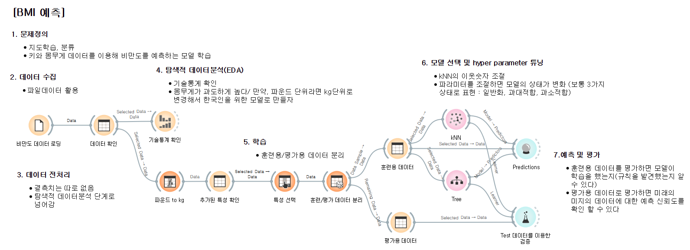

<table>
  <tr>
    <td style = "vertical-align: top;">
      <h4>Train 데이터를 활용한 Prediction</h4>
      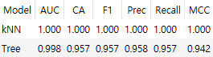
    </td>
    <td style = "vertical-align: top;">
      <h4>Test 데이터를 이용한 검증</h4>
      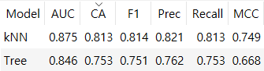
    </td>
  </tr>
</table>

 

#### 결과해석
- CA(Classificatino Accuracy, 분류 정확도)가 1에 가까울 수록 정확도가 높다.

- kNN모델의 정확도가 Tree 모델 보다 높다.

 

### 2. 붓꽃 예측
> 비지도학습

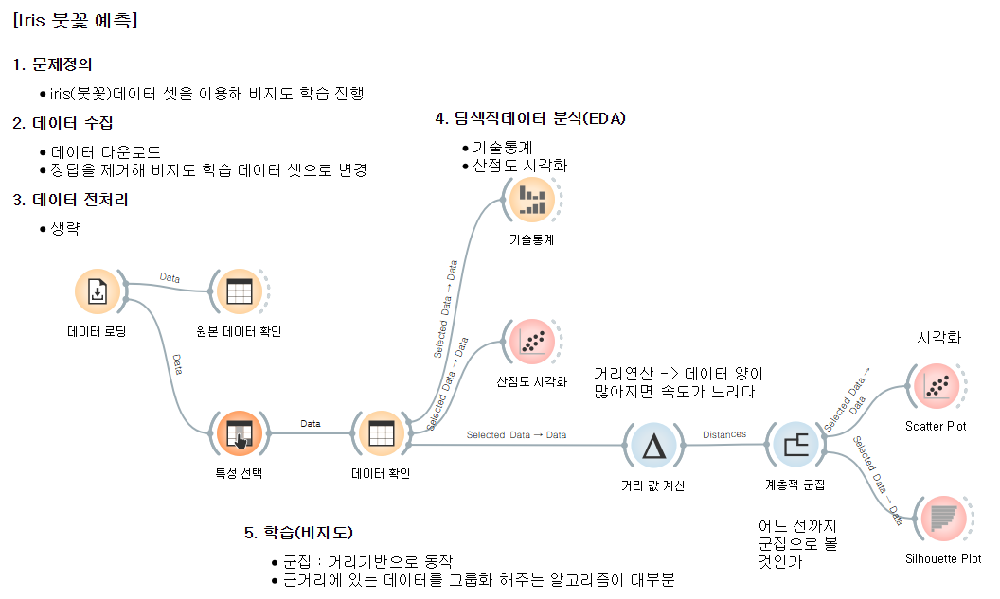

#### 시각화

<table>
  <tr>
    <td style = "vertical-align: top;">
      <h4>Scatter Plot</h4>
      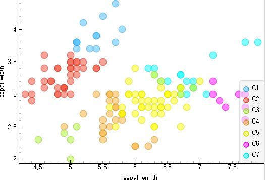
    </td>
    <td style = "vertical-align: top;">
      <h4>Silhouette Plot</h4>
      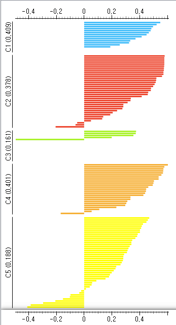
    </td>
  </tr>
</table>

**결과해석**

거리적으로 유의미하게 모여있거나 떨어져있을 때 값이 높게 나타난다.

 

### 3. 와인 품질 등급관리
> 비지도학습

#### 시나리오

1. **BX** : 와인에 대한 접근성을 높여서 와인 문화를 대중화 시키자
2. **CX** : 언제 어디서나 맛있는 와인을 쉽게 경험, 한 번의 경험으로도 즐거운 추억을 남길 수 있도록 하자
3. **DX** : 균등한 품질의 맛있는 와인을 지속적으로 제공하자, 추천 시스템, 구독 시스템
 
- Trigger : 제품별 와인 후기(고객 VOC), 와인경험 사례 데이터
 
- Accelerator : 와인 제조 공정 데이터, 제품의 성분 및 등급 데이터
 
- Tracker : 제조 공정 변화에 따른 성분 검사결과, 상품 후기, 새로운 와인 입문자의 유입률, 구독자 수치 변화 등

#### 1) 문제 정의
- 와인 성분 및 등급 데이터를 머신러닝을 이용해 분석을 진행하고 일정한 품질이 유지될 수 있도록 공정 프로세스를 점검하자

#### 2) 데이터 수집
- UCI 저장소에 공개되어 있는 와인성분 데이터 활용(red, white)
- 데이터 로딩 후 concat

#### 3) 데이터 전처리
- 결측지 없음
- 등급 데이터의 카테고리 통합
- 데이터 스케일링

#### 4) 탐색적 데이터 분석(EDA)
- 기술통계 확인
- 분포 확인
- 산점도 확인

<table>
  <tr>
    <td style = "vertical-align: top;">
      <h4>분포 확인</h4>
      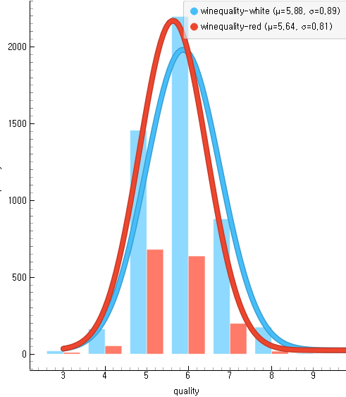
    </td>
    <td style = "vertical-align: top;">
      <h4>산점도 확인</h4>
      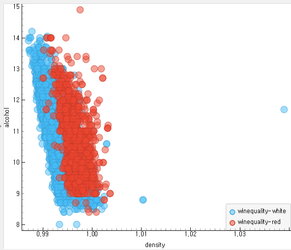
    </td>
  </tr>
</table>

#### 5) Model 선택, Hyper Parameter 조정

a. 등급이 3~9개의 등급 데이터를 가지고 있는데 분포가 불균형하다

- 정답 데이터가 불균형한 경우 모델의 성능이 저하될 가능성이 있다.
- 아래 방법 등으로 해결하여 되도록 균등하게 만들어 준다.
    - 과도한 데이터 삭제
    - 부족한 데이터 증강
    - 카테고리 통합

b. Feature Engineering
- 등급의 카테고리화
    - low : 3, 4, 5
    - mid : 6
    - high : 7, 8, 9

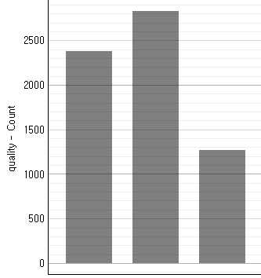

c. 기존 등급열 제외 후 새로운 등급 데이터와 병합
- 각 특성의 range가 다르면 모델에 따라서 영향을 받는 경우가 있다.

#### 7. 비지도 학습

- PCA를 통해 주성분을 추출하면 원래 특성의 수만큼 나온다.
- 먼저 추출된 성분일 수록 많은 정보량을 가지고 있다.(주요 성분)
- 설명력이 보통 50% 이상되는 성분들만 추려서 활용한다 -> 차원축소
- 데이터 분석은 샘플의 수가 많지 않아 특성이 과도하게 많은 것은 별로 좋지 않다. VS 딥러닝은 샘플 수가 많은 것을 전제로 하기 때문에 차원이 많아도 상관 없다.
'

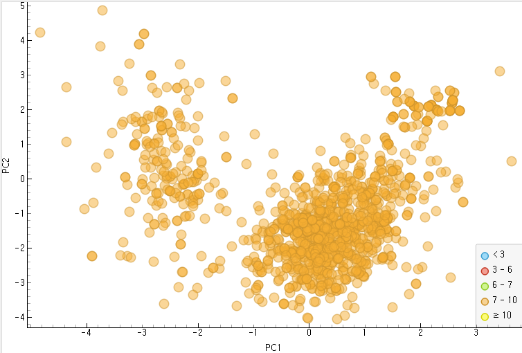

#### 결론
> 자주 나오는 성분들이 비슷한 값이 나올 수 있도록 공정 프로세스를 조정해야 한다.

 

### 4. 연예인 닮은꼴 분석

#### 1) 문제 정의
- 3명의 3연예인 사진을 분류하는 작업 진행

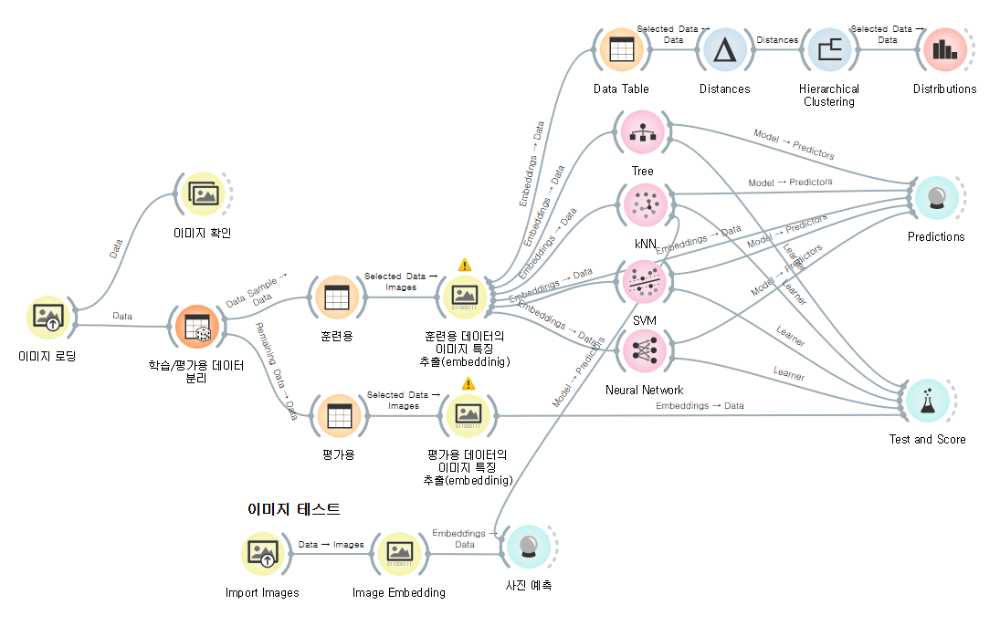

테스트 사진을 통해 

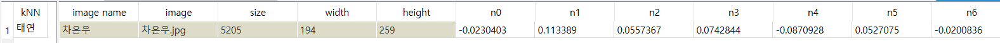